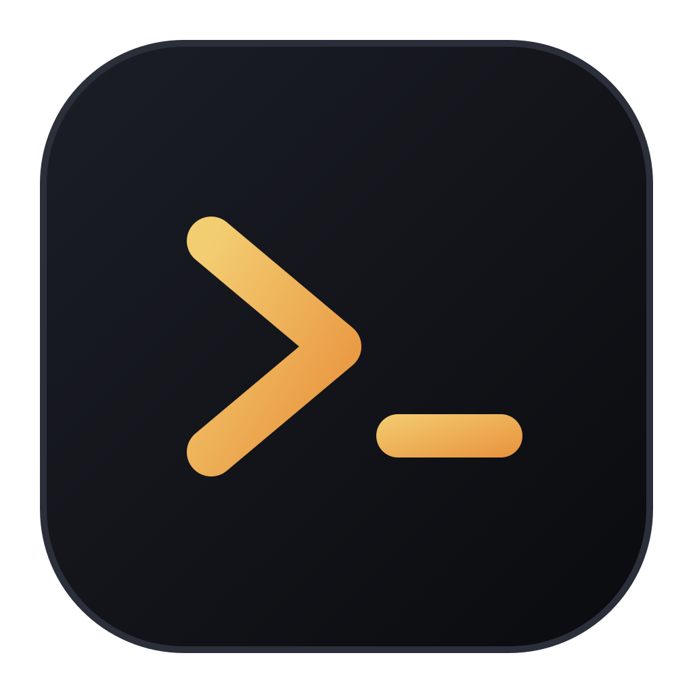

<div align="center">



# Mayo's IdeTerm

### One control center for your IDEs, terminals, repos, and coding agents.

*Stop alt-tabbing across five windows to run four tools on three repos. Point IdeTerm at your folders and launch the right thing, in the right place, in one click.*


</div>

---

## ⬇️ Download & install

Grab the latest installer for your OS from the [**Releases**](https://github.com/quentinmayo/ideterm/releases) page:

| OS | File | Notes |
|---|---|---|
| 🪟 **Windows** | `IdeTerm-x.y.z-Setup.exe` | NSIS installer — pick your install directory, gets Start-menu + desktop shortcuts. |
| 🍎 **macOS** | `IdeTerm-x.y.z-<arch>.dmg` | Drag to Applications. |
| 🐧 **Linux** | `IdeTerm-x.y.z.AppImage` / `.deb` | `chmod +x` the AppImage and run, or install the `.deb`. |

> Builds are currently **unsigned**, so Windows SmartScreen / macOS Gatekeeper may warn on first launch
> (More info → Run anyway / right-click → Open). In-app **Settings → Check for updates** tells you when a
> newer release is out.

---

## 🤔 Why does this exist?

Modern engineering rarely happens in *one* folder. You've got a frontend, a backend, a couple of
services, and an infra repo — each wants a different tool. VS Code here. Cursor there. A terminal
running `claude` in that one. A shell tailing logs in another. Your IDE assumes a single workspace
tree; your AI tools assume you want to forget the source even exists.

**IdeTerm makes the unit of work a *project of many folders*.** Each folder shows its live Git
state, and a right-click launches the exact tool, terminal, or agent you want — externally or
embedded right inside the app.

> It is **not** another editor, and it's not trying to be VS Code, Cursor, Warp, or Claude Code.
> It's the calm layer that *orchestrates* all of them.

---

## ✨ What you get

### 🧰 A universal launcher
At its heart, a "tool" is just **an executable + flags + how to run it**. That's it — so IdeTerm can
launch *anything* you can name a path to. It auto-detects the usual suspects on first run:

| Platform | Detected out of the box |
|---|---|
| **Windows** | VS Code, Cursor, Warp, Claude Code, Windows Terminal, PowerShell 7, Windows PowerShell, Git Bash, WSL |
| **macOS** | VS Code, Cursor, Warp, Claude Code, your login `$SHELL` |
| **Linux** | VS Code, Cursor, Claude Code, GNOME Terminal, Konsole, your login `$SHELL` |

Add your own with a name, path, args, icon, type, and one of three **launch modes**:

- **`external`** — detached OS process with its own window (IDEs, GUI terminals).
- **`shell`** — the executable *is* the shell, run inside an embedded terminal.
- **`command`** — run your default shell embedded, then type the tool's command (e.g. `claude --dangerously-skip-permissions`).

### 📁 Projects = folders that belong together
Group `C:\dev\frontend`, `…\backend`, `…\scanner-service`, and `…\infra` into one project. Each
folder card shows **branch · clean/dirty · staged/modified/untracked · ahead/behind · last commit**.
Got a parent directory full of repos? Use **"Break into subfolders…"** to expand it into its
children, with select-all/none and an option to drop the parent.

### 🖥️ Embedded terminals that actually tile
Real PTY-backed terminals (via [`@lydell/node-pty`](https://www.npmjs.com/package/@lydell/node-pty)
+ xterm.js), docked at the bottom:

- **Recursive split tiling** — split any pane left/right *or* top/bottom, as deep as you like, drag the dividers.
- **Float** a pane into a draggable, resizable window — and dock it back.
- **Tabs** per terminal group, plus **rename**, **kill**, **restart**, and **saved commands**.
- Scrollback survives tab switches and layout changes (xterm instances are cached outside React).

### 🌿 Inline Git
Stage/unstage individual files or all at once, write a commit message, **commit · push · pull ·
fetch**, view per-file diffs with syntax-colored +/− lines, copy the branch, or pop the repo open
in your IDE — without leaving IdeTerm.

### 🗂️ File tree + lightweight editor
Browse a folder, open/edit/save files in a CodeMirror 6 editor with syntax highlighting for **~30
languages** (TS/JS, JSON, HTML, CSS/SASS, Vue, Markdown, Python, Rust, Go, Java, C/C++, PHP, SQL,
XML, YAML, plus shell, Dockerfile, TOML, INI, Ruby, C#, Kotlin, Swift, Lua, PowerShell, and more).
Create, rename, delete, and drag-to-move files and folders. Deliberately *not* a full IDE — no LSP,
no extensions, just fast navigation and edits.

### 🔐 SSH command builder
Assemble an `ssh` command from a form (host, user, port, identity file, agent forwarding, extra
flags, remote command), then run it in an embedded terminal or save it for reuse — with a loud,
honest warning that the session is **local-terminal-only** (your IDEs and agents are *not* magically
teleported onto the remote box).

---

## 🖼️ The layout

```
┌──────┬───────────────────────────────────────────────────────┐
│ 🍯   │  Mayo ASPM · 4 folders                  [Edit] [+ Add] │
│      │  ┌─────────────┐ ┌─────────────┐ ┌─────────────┐       │
│ 📁   │  │ frontend    │ │ backend     │ │ infra       │       │
│ Proj │  │ ⎇ main ●    │ │ ⎇ main ✓   │ │ ⎇ main ✓    │  ⋯    │
│      │  │ ~3 ?1       │ │ clean       │ │ clean       │       │
│ 🧰   │  └─────────────┘ └─────────────┘ └─────────────┘       │
│ Tool │                                                        │
│      ├───────────────────────────────────────────────────────┤
│ ▦    │ ▦ backend ·zsh  ▦ claude  [+]            ▥ ▤ ⌄        │
│ Sess │ ┌──────────────────────┬──────────────────────────┐   │
│      │ │ $ npm run dev        │ $ claude                 │   │
│ 🗂    │ │ ▸ listening :3000    │ > how can I help?        │   │
│ File │ └──────────────────────┴──────────────────────────┘   │
│ ⚙    │                                          (Ctrl+`)      │
└──────┴───────────────────────────────────────────────────────┘
```

---

## ⌨️ Handy bits

| Shortcut / action | Does |
|---|---|
| `Ctrl` / `Cmd` + `` ` `` | Toggle the terminal dock |
| Right-click a folder card | Full action menu (open in IDE, terminal, agent, Git, copy, reveal…) |
| `Ctrl` / `Cmd` + `S` (in editor) | Save the file |
| `▥` / `▤` on a terminal pane | Split right / split down |
| `⧉` / `▭` | Float a pane out / dock it back |
| Double-click a terminal title | Rename the session |

---

## 🚀 Getting started

```bash
npm install      # ✅ no compiler / Visual Studio needed — PTY ships prebuilt N-API binaries
npm run dev      # 🔥 launch with hot reload
npm run check    # 🧪 typecheck + run the unit tests
npm run build    # 📦 typecheck + bundle to out/
npm run dist     # 💿 build an installer for the current OS (nsis / dmg / AppImage)
```

**Requirements:** Node 18+ and Git on your `PATH`. Runs on Windows, macOS, and Ubuntu/Linux.

---

## 🏗️ Architecture

```
src/
  shared/    Types + the window.api contract (no Node/DOM imports)
  main/      Electron main process (Node)
    store.ts            Atomic JSON persistence in the OS user-data dir
    ipc.ts              All ipcMain handlers
    services/
      tools.ts          Per-OS tool auto-detection
      launcher.ts       Launch external / embedded-shell / embedded-command
      launchCommand.ts  Pure command-line building  (unit tested)
      git.ts            simple-git wrapper
      pty.ts            node-pty session manager
      fs.ts             Sandboxed file operations
      pathSafety.ts     Pure path-containment guards   (unit tested)
      ssh.ts            Pure ssh command builder        (unit tested)
  preload/   contextBridge → window.api  (contextIsolation on, nodeIntegration off)
  renderer/  React UI: nav · projects · tools · sessions · files · settings
    terminal/  xterm view, recursive tile layout, dock, floating panels
    files/     file tree + CodeMirror editor
    state/     AppState + Terminals React contexts
test/        Vitest suites (ssh, launch command, path safety, tile tree)
```

The renderer never touches `fs` or `child_process` — every privileged action goes through the typed
`window.api` bridge to the main process. All file operations are sandboxed to your configured
project-folder roots.

## 💾 Where state lives

Projects, custom tools, saved commands, and settings are stored in a single version-stamped JSON
file in your OS user-data directory (e.g. `%APPDATA%/ideterm/ideterm.json` on Windows), written
atomically so a crash mid-save can't corrupt it.

## 🔒 Security

- `contextIsolation: true`, `nodeIntegration: false`.
- External links open in your real browser; arbitrary `window.open`/navigation is denied.
- File operations are restricted to paths inside your project folders.
- `spawn` uses argument arrays; "dangerous" flags are only ever the ones *you* configure.
- The SSH builder opens a **local** session only — it does not connect your other tools to a remote host.
- **Known follow-up:** a production Content-Security-Policy is not yet set (Electron shows a
  dev-only warning that's suppressed in packaged builds). Add one before distributing.

## 🧪 Testing

`npm test` runs the Vitest suite (currently **36 tests**) covering the pure logic: SSH command
assembly, launch-command building, the path-sandbox guards, and the terminal tiling tree. Run
`npm run check` to typecheck and test together before committing.

## 🗺️ Roadmap

- Project-wide search and per-tool environment overrides
- Session persistence/restore across restarts
- Production CSP hardening
- Git stash / branch-switch UI
- Theming and a plugin API

## 🤝 Contributing

Issues and PRs welcome. Before opening a PR, please run `npm run check` (typecheck + tests) and
`npm run build`. Keep new code in the same style as its neighbors.

## 📄 License

MIT © Quentin Mayo
