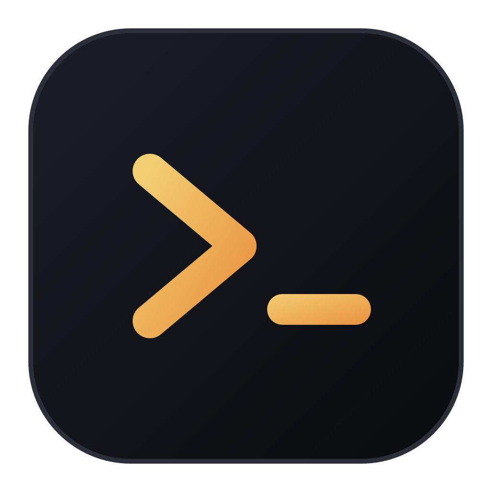
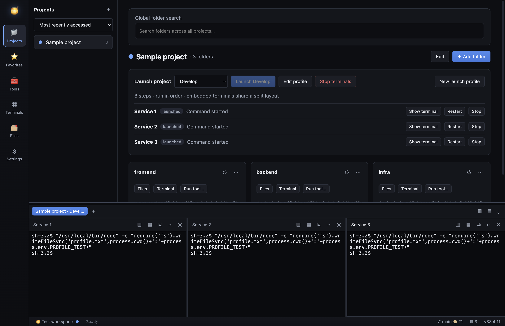

<div align="center">



# Mayo's IdeTerm

### One control center for your IDEs, terminals, repos, and coding agents.

*Stop alt-tabbing across five windows to run four tools on three repos. Point IdeTerm at your folders and launch the right thing, in the right place, in one click.*


[](https://github.com/quentinmayo/ideterm/actions/workflows/check.yml)


</div>

---

## ⬇️ Download & install

Grab the latest installer for your OS from the [**Releases**](https://github.com/quentinmayo/ideterm/releases) page:

| OS | File | Notes |
|---|---|---|
| 🪟 **Windows** | `IdeTerm-x.y.z-Setup.exe` | NSIS installer — pick your install directory, gets Start-menu + desktop shortcuts. |
| 🍎 **macOS** | `IdeTerm-x.y.z-<arch>.dmg` | Drag to Applications. |
| 🐧 **Linux** | `IdeTerm-x.y.z.AppImage` / `.deb` | `chmod +x` the AppImage and run, or install the `.deb`. |

> Builds are currently **unsigned**, so Windows SmartScreen / macOS Gatekeeper may warn on first launch
> (More info → Run anyway / right-click → Open). In-app **Settings → Check for updates** tells you when a
> newer release is out.

---

## 🤔 Why does this exist?

Modern engineering rarely happens in *one* folder. You've got a frontend, a backend, a couple of
services, and an infra repo — each wants a different tool. VS Code here. Cursor there. A terminal
running `claude` in that one. A shell tailing logs in another. Your IDE assumes a single workspace
tree; your AI tools assume you want to forget the source even exists.

**IdeTerm makes the unit of work a *project of many folders*.** Each folder shows its live Git
state, and a right-click launches the exact tool, terminal, or agent you want — externally or
embedded right inside the app.

> It is **not** another editor, and it's not trying to be VS Code, Cursor, Warp, or Claude Code.
> It's the calm layer that *orchestrates* all of them.

---

## ✨ What you get

### ▶ Launch your whole project (next release)



Create a project, add your repositories, then select **New launch profile**. Name it **Develop**,
**Debug**, or **Review**, and choose a folder and a tool or command for each step. Saved profiles
live in the workspace snapshot. Click **Launch Develop** to start the entire setup.

For example: open the frontend in your IDE, start the backend in an embedded terminal, wait for
its local port, and launch an agent in the infra repo. Embedded terminals share a split layout.
Each step can specify environment overrides and an optional TCP readiness check at `127.0.0.1`.
The runner validates folder/tool references and port availability before starting. If a launch or
readiness check fails, later steps are skipped and earlier terminals remain available for inspection.
**Stop terminals** cancels pending steps and closes the profile's embedded terminals; external
applications stay open. Individual terminals can be restarted with their original command and
environment. Without a readiness check, **launched** means the terminal was started, not that its
command succeeded. Restoring a snapshot opens shells without rerunning profile commands.

Environment overrides and recovery drafts are saved as plain text in the snapshot. Use local
credential tooling for secrets rather than storing them in a shared profile.

### 🧰 A universal launcher
At its heart, a "tool" is just **an executable + flags + how to run it**. That's it — so IdeTerm can
launch *anything* you can name a path to. It auto-detects the usual suspects on first run:

| Platform | Detected out of the box |
|---|---|
| **Windows** | VS Code, Cursor, Warp, Claude Code, Windows Terminal, PowerShell 7, Windows PowerShell, Git Bash, WSL |
| **macOS** | VS Code, Cursor, Warp, Claude Code, your login `$SHELL` |
| **Linux** | VS Code, Cursor, Claude Code, GNOME Terminal, Konsole, your login `$SHELL` |

Add your own with a name, path, args, icon, type, and one of three **launch modes**:

- **`external`** — detached OS process with its own window (IDEs, GUI terminals).
- **`shell`** — the executable *is* the shell, run inside an embedded terminal.
- **`command`** — run your default shell embedded, then type the tool's command (e.g. `claude --dangerously-skip-permissions`).

### 📁 Projects = folders that belong together
Group `C:\dev\frontend`, `…\backend`, `…\scanner-service`, and `…\infra` into one project. Each
folder card shows **branch · clean/dirty · staged/modified/untracked · ahead/behind · last commit**.
Got a parent directory full of repos? Use **"Break into subfolders…"** to expand it into its
children, with select-all/none and an option to drop the parent. Folder cards expose Files, Terminal,
and Run tool actions directly. Git summaries refresh after in-app changes and when the window
regains focus.

### 🖥️ Embedded terminals that actually tile
Real PTY-backed terminals (via [`@lydell/node-pty`](https://www.npmjs.com/package/@lydell/node-pty)
+ xterm.js), docked at the bottom:

- **Recursive split tiling** — split any pane left/right *or* top/bottom, as deep as you like, drag the dividers.
- **Float** a pane into a draggable, resizable window — and dock it back.
- **Tabs** per terminal group, plus **rename**, **kill**, **restart**, and **saved commands**.
- Scrollback survives tab switches and layout changes (xterm instances are cached outside React).

### 🌿 Inline Git
Stage/unstage individual files or all at once, write a commit message, **commit · push · pull ·
fetch**, view per-file diffs with syntax-colored +/− lines, copy the branch, or pop the repo open
in your IDE — without leaving IdeTerm.

### 🗂️ File tree + lightweight editor
Browse a folder, open/edit/save files in a CodeMirror 6 editor with syntax highlighting for **~30
languages** (TS/JS, JSON, HTML, CSS/SASS, Vue, Markdown, Python, Rust, Go, Java, C/C++, PHP, SQL,
XML, YAML, plus shell, Dockerfile, TOML, INI, Ruby, C#, Kotlin, Swift, Lua, PowerShell, and more).
Create, rename, delete, and drag-to-move files and folders. Deliberately *not* a full IDE — no LSP,
no extensions, just fast navigation and edits.

### 🔐 SSH command builder
Assemble an `ssh` command from a form (host, user, port, identity file, agent forwarding, extra
flags, remote command), then run it in an embedded terminal or save it for reuse — with a loud,
honest warning that the session is **local-terminal-only** (your IDEs and agents are *not* magically
teleported onto the remote box).

### 💾 Workspace snapshots (Burp-style)
Your whole working context — Projects, open file tabs, the terminal tiling layout (re-spawned at
their cwds), active view, dock & floating panels — is saved as a **session snapshot** file you can
reopen anytime. A startup **launcher** lets you create a *temporary* session, a *new project on
disk*, *open an existing* one, or jump back into the most recent. Snapshots **autosave every minute**
and on close; if the app crashes, the launcher offers to **restore** your last session. Drive it all
from the **File menu** (New / Open / Save / Save As / Recent) or set "always open the most recent" in
Settings. Tools and preferences stay global across every snapshot.

Unsaved editor buffers survive view changes. Recovery drafts autosave after a one-second pause
and on close, and reopening the snapshot restores them as unsaved tabs. **Save Session** preserves
drafts; **Ctrl/Cmd+S** in the editor writes the actual source file. Closing a dirty tab offers
Save / Discard / Cancel. Switching sessions first saves the current snapshot. Starting another
temporary session prompts for a location to preserve the current temporary workspace.
A failed close-time save lets you keep the window open and retry.

---

## 🖼️ The layout

```
┌──────┬───────────────────────────────────────────────────────┐
│ 🍯   │  Mayo ASPM · 4 folders                  [Edit] [+ Add] │
│      │  ┌─────────────┐ ┌─────────────┐ ┌─────────────┐       │
│ 📁   │  │ frontend    │ │ backend     │ │ infra       │       │
│ Proj │  │ ⎇ main ●    │ │ ⎇ main ✓   │ │ ⎇ main ✓    │  ⋯    │
│      │  │ ~3 ?1       │ │ clean       │ │ clean       │       │
│ 🧰   │  └─────────────┘ └─────────────┘ └─────────────┘       │
│ Tool │                                                        │
│      ├───────────────────────────────────────────────────────┤
│ ▦    │ ▦ backend ·zsh  ▦ claude  [+]            ▥ ▤ ⌄        │
│ Sess │ ┌──────────────────────┬──────────────────────────┐   │
│      │ │ $ npm run dev        │ $ claude                 │   │
│ 🗂    │ │ ▸ listening :3000    │ > how can I help?        │   │
│ File │ └──────────────────────┴──────────────────────────┘   │
│ ⚙    │                                          (Ctrl+`)      │
└──────┴───────────────────────────────────────────────────────┘
```

---

## ⌨️ Handy bits

| Shortcut / action | Does |
|---|---|
| `Ctrl` / `Cmd` + `` ` `` | Toggle the terminal dock |
| Right-click a folder card | Full action menu (open in IDE, terminal, agent, Git, copy, reveal…) |
| `Ctrl` / `Cmd` + `S` (in editor) | Save the file |
| `▥` / `▤` on a terminal pane | Split right / split down |
| `⧉` / `▭` | Float a pane out / dock it back |
| Double-click a terminal title | Rename the session |

---

## 🚀 Getting started

```bash
npm install      # ✅ no compiler / Visual Studio needed — PTY ships prebuilt N-API binaries
npm run dev      # 🔥 launch with hot reload
npm run check    # 🧪 typecheck + run the unit tests
npm run build    # 📦 typecheck + bundle to out/
npm run test:e2e # exercise the built Electron app with isolated test workspaces
npm run dist     # 💿 build an installer for the current OS (nsis / dmg / AppImage)
```

**Requirements:** Node 22+ and Git on your `PATH`. Runs on Windows, macOS, and Ubuntu/Linux.

---

## 🏗️ Architecture

```
src/
  shared/    Types + the window.api contract (no Node/DOM imports)
  main/      Electron main process (Node)
    store.ts            Atomic JSON persistence in the OS user-data dir
    ipc.ts              All ipcMain handlers
    services/
      tools.ts          Per-OS tool auto-detection
      launcher.ts       Launch external / embedded-shell / embedded-command
      launchCommand.ts  Pure command-line building  (unit tested)
      git.ts            simple-git wrapper
      pty.ts            node-pty session manager
      fs.ts             Sandboxed file operations
      pathSafety.ts     Pure path-containment guards   (unit tested)
      ssh.ts            Pure ssh command builder        (unit tested)
  preload/   contextBridge → window.api  (contextIsolation on, nodeIntegration off)
  renderer/  React UI: nav · projects · tools · sessions · files · settings
    terminal/  xterm view, recursive tile layout, dock, floating panels
    files/     file tree + CodeMirror editor
    state/     AppState + Terminals React contexts
test/        Vitest suites (ssh, launch command, path safety, tile tree)
```

The renderer never touches `fs` or `child_process` — every privileged action goes through the typed
`window.api` bridge to the main process. All file operations are sandboxed to your configured
project-folder roots.

## 💾 Where state lives

Custom tools, commands, preferences, and the recent-session registry live in the version-stamped
`ideterm.json` in your OS user-data directory (e.g. `%APPDATA%/ideterm/` on Windows).
Projects, launch profiles, editor recovery drafts, and layouts live in `*.ideterm-session.json`
snapshots. Writes to each destination are serialized and use a unique temporary file plus rename.
Malformed snapshots are rejected before activation. If global configuration is unreadable, its
original contents are preserved in an `ideterm.json.corrupt-<timestamp>` backup.

## 🔒 Security

- `sandbox: true`, `contextIsolation: true`, `nodeIntegration: false`; a bundled CommonJS preload works inside the sandbox.
- External links open in your real browser; arbitrary `window.open`/navigation is denied.
- File operations check both lexical and resolved paths against project roots, including existing ancestors of new files. Links escaping those roots are rejected; root deletion/moves and destination overwrites are blocked.
- External executables use argument arrays. Windows batch shims use a restricted `cmd.exe` adapter; literal arguments to embedded tools are quoted for POSIX, PowerShell, or cmd. Freeform command steps intentionally run shell code.
- The SSH builder opens a **local** session only — it does not connect your other tools to a remote host.
- Production windows enforce a Content-Security-Policy. Every IPC handler validates the sending main frame and its argument schema. Browser links allow only HTTP/HTTPS.

## 🧪 Testing

`npm run check` typechecks both processes and runs unit tests, including concurrent persistence,
symlink boundaries, shell quoting, and IPC validation. `npm run build && npm run test:e2e` runs
Playwright against Electron using temporary user-data directories and fixture repositories. It
covers draft recovery, tool-mode forwarding, project profiles, readiness, cancellation, and macOS
window reopening. On a headless Linux machine use `xvfb-run --auto-servernum npm run test:e2e`.

The Checks workflow runs typechecking, unit tests, builds, and Electron integration tests on every
pull request and main-branch push on Windows, macOS, and Ubuntu. No test launches user profiles or
writes to the normal IdeTerm configuration directory.

## 🗺️ Roadmap

- Signed and notarized installers (requires publisher certificates and Apple credentials)
- Dependency/runtime upgrades and ongoing security maintenance
- Git stash / branch-switch UI
- Theming and a plugin API

## 🤝 Contributing

Issues and PRs welcome. Before opening a PR, please run `npm run check` (typecheck + tests) and
`npm run build`. Keep new code in the same style as its neighbors.

## 📄 License

MIT © Quentin Mayo
